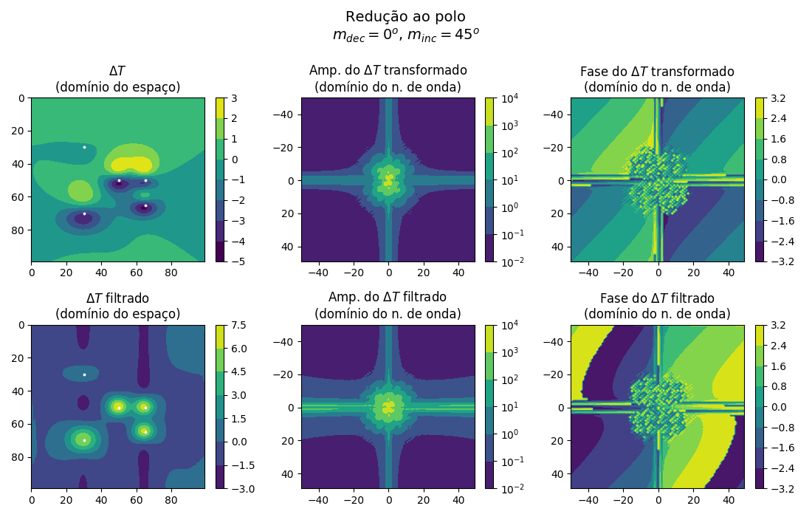
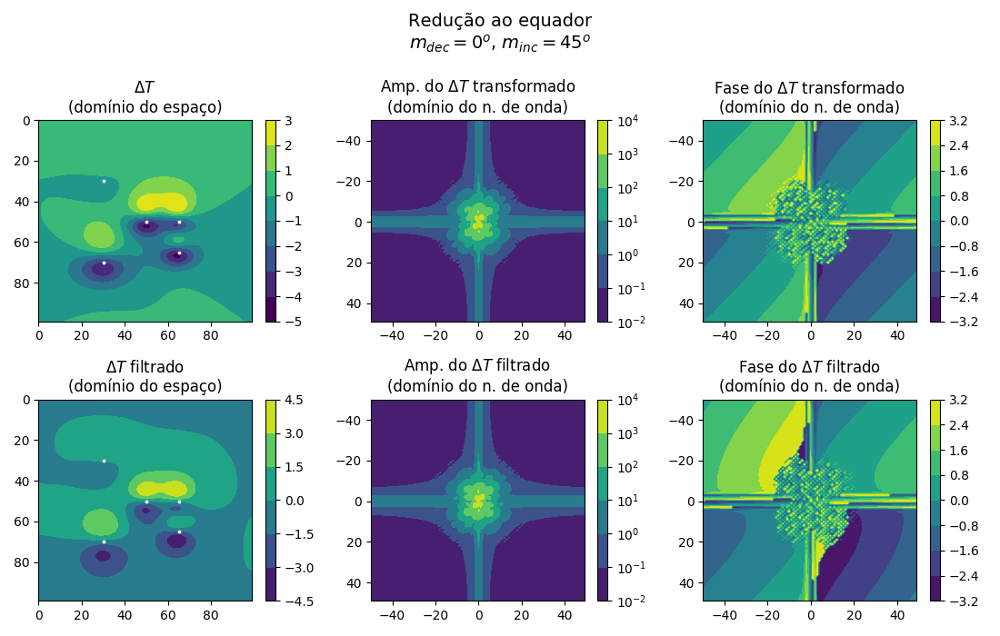
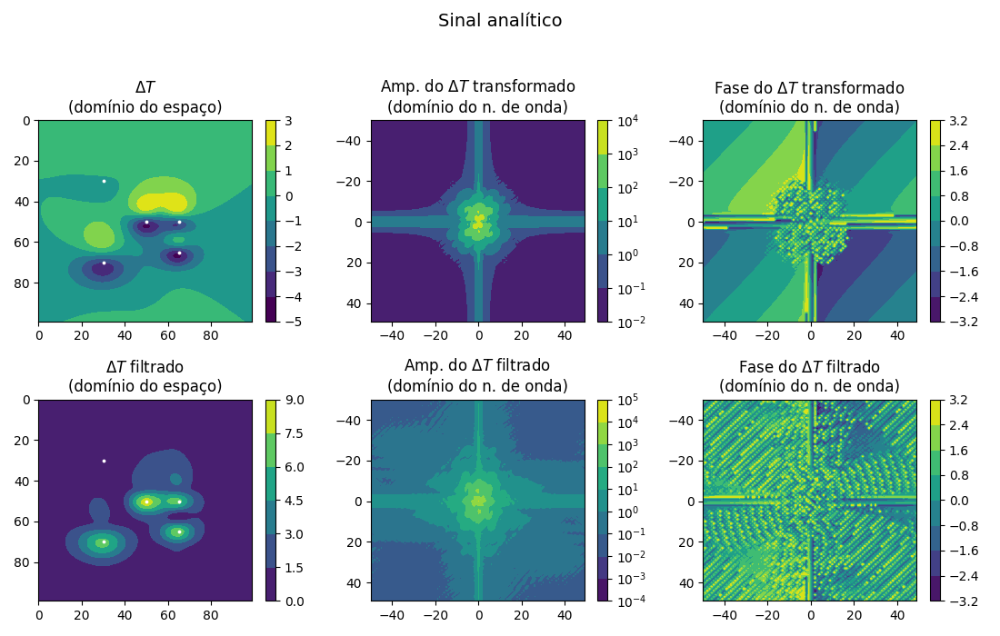
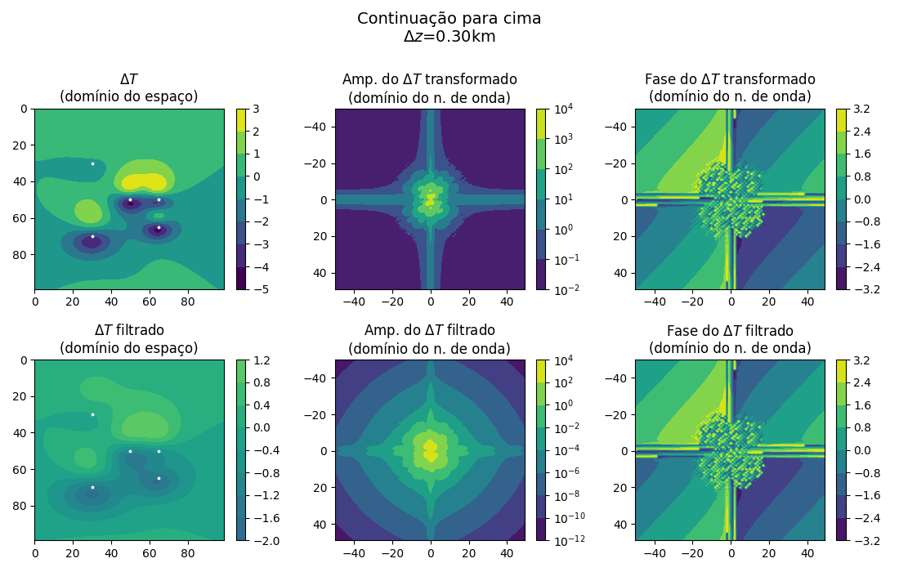
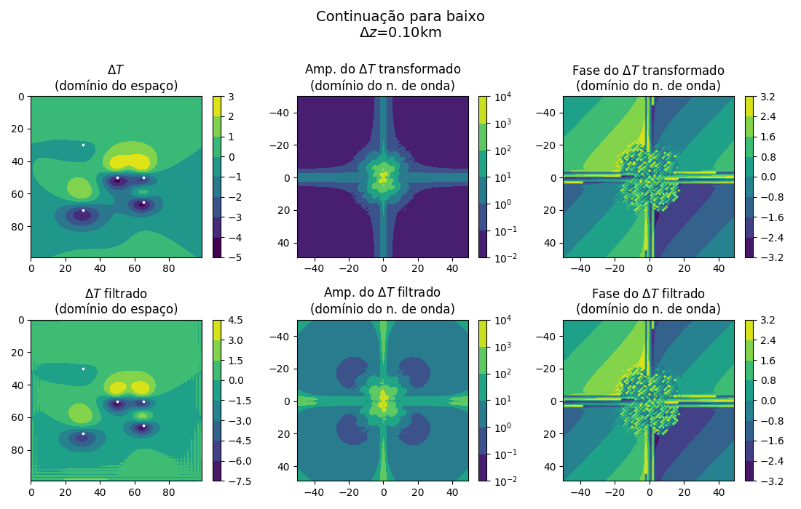

# potential_methods_processing

Some useful processes implementations to apply on 2D gravimetric and magnetic data:
  - reduction to the pole (rtp);

  

  - reduction to the equator (rte); and

  

  - analytic signal aplitude (asa).

  

  - upward continuation (uc);

  

  - downward continuation (dc);

  

The magnetic data used as example were modeled with the routines present in Richard j. Blakely's "Potential Theory in Gravity and Magnetic Applications"'s Apendix B.
